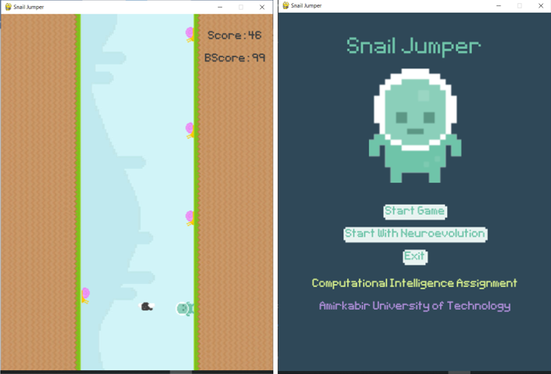
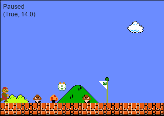

# Evolutionary-Projects

Implementation of agents to play game for 2 games using Evolutionary algorithms

## Snail jumper
It uses ANN and Evolutionary algorithm in a snail jumper game. It starts with 300 players and they converge and learn to do better in the next generations.

## Super Mario
In this projects we have some predefined levels for mario and our goal is we find the sequence of actions for each level to pass that level with high score using genetic algorithm.

