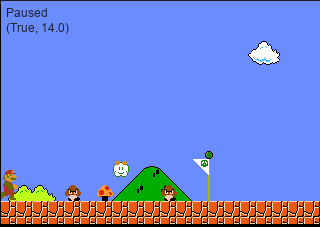
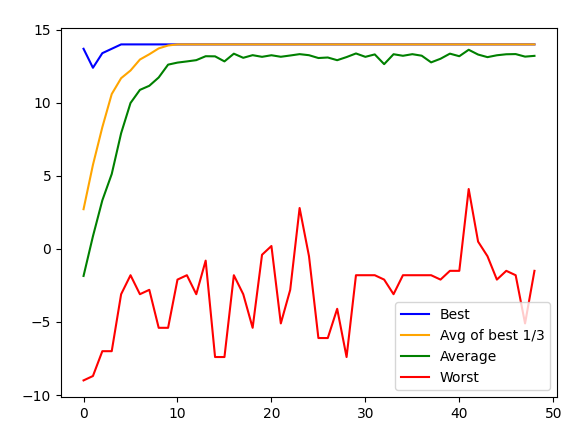

# Super Mario

In this projects we have some [predefined levels](./levels/) for mario and our goal is we find the sequence of actions for each level to pass that level with high score using genetic algorithm.

Also I create a graphical user interface using pygame:

*   Key `a` : show next action
*   Key `d` : shwo prev action
*   Key `space`: stop and start
*   Key `escape`: quit program

## RUN
        python3 main.py

## Result
This is the result for level 5.
*   `x axis` is the number of generations
*   `y axis` is score

